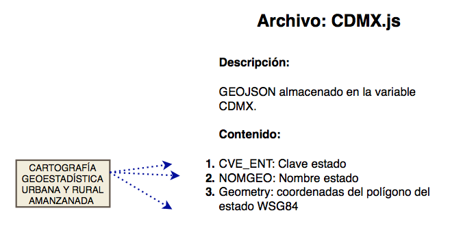
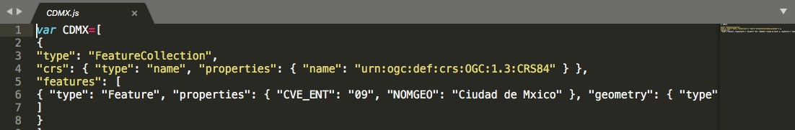

#  CDMX

Información geoespacial de la Ciudad de Mexico 

## Procedimiento para crear el archivo CDMX.js



### Insumos

Marco Geoestadístico Nacional INEGI.

"El Marco Geoestadístico es un sistema único y de carácter nacional diseñado por el INEGI, el cual presenta la división del territorio nacional en diferentes niveles de desagregación para referir geográficamente la información estadística de los censos y encuestas institucionales y de las Unidades del Estado, que se integra al Sistema Nacional de Información Estadística y Geográfica (SNIEG)."


Detalle:

Archivo vectorial que integra un sistema único y de carácter nacional diseñado por el INEGI, el cual contiene las siguientes capas de información: 32 polígonos de las Áreas Geoestadísticas Estatales (AGEE), 2 463 polígonos de las Áreas Geoestadísticas Municipales (AGEM) en las que se incluyen las 16 Demarcaciones de la Ciudad de México, 17 469 polígonos de las Áreas Geoestadísticas Básicas Rurales (AGEB), 49 720 Polígonos de localidades urbanas y rurales, 351 polígonos del Territorio Insular (islas) y 254 789 Localidades rurales puntuales que no son amanzanadas y por lo tanto no cuentan con un plano. Cada Localidad urbana y rural cuenta con sus capas de amanzanamiento. Los elementos de estas capas cuenta con atributos de nombre y clave geoestadística

<hr>

### Detalle de procesamiento

El Marco Geoestadístico Nacional es un producto de libre descarga proporcionado por INEGI mediante la [liga](http://www.beta.inegi.org.mx/temas/mapas/mg/)  es importante realizar la descarga de la última versión disponible con desglose geogéfico a nivel de Ageb. 

Una vez descargado el archivo debe seleccionarse y descomprimirse el zip correspondiente al estado Ciudad de Mexico: **09_ciudaddemexico.zip**

De esta forma encontramos un arbol de carpetas

09_ciudaddemexico    
.    |____ catalogos      
.    |____ conjunto de datos     
.    |____ metadatos     


En la carpeta conjunto de datos tenemos información geoespacial de la Ciudad de México.

Los nombre comienzan con la clave INEGI de la entidad - en este caso 09-

Despues de la cclave "09" encontramos un sufijo que nos indica el contenido específico.  En el caso particular utilizamos el sufijo **ent** que corresponde al shape **SHP** de todo el estado

La información fuente está formada por todos los archivos cuyos nombres comienzan con **09ent.**

  + 09ent.shp   (archivo principal)      

  + 09ent.dbf

  + 09ent.prj

  + 09ent.sbn

  + 09ent.sbx

  + 09ent.shx


#### Apertura de información en Qgis   

**Requisito:**   En el equipo donde procesará la información debe contar con los programas [**R**](https://www.r-project.org/) R Project, [**RSstudio**](https://www.rstudio.com/)  y  [**Qgis**](https://qgis.org/en/site/) A Free and Open Source Geographic Information System.   


#### Generación del archivo en geojson

El código en R presenta la  función: ** geojson_write (biblioteca geojsonio) **

#### Ajuste del archivo geojson para su incorporacion en la página

En un editor de texto plano, *en nuestro caso usamos [**sublime text.app**](https://www.sublimetext.com/)*  se añande al inicio del archivo la linea

**var CDMX = [**

y al final del archivo se cierra 

**]**


el archivo se guarda con la extensión **js**

<hr>


### Detalle del código R en CodigoDatos.R  


.... linea 624

```R
#### generacion del shape CDMX en geojson
ruta = "DATOS/AGEBS_CDMX/conjunto de datos"
ogrfile2 = "areas_geoestadisticas_estatales"
shapeoriginal <- readOGR(ruta, ogrfile2)
shapeCDMX <-shapeoriginal[shapeoriginal$CVE_ENT=="09",]
map_wgs84CDMX <- spTransform(shapeCDMX, CRS("+proj=longlat +datum=WGS84"))
map_wgs84CDMX@data$NOM_ENT<-iconv(map_wgs84CDMX@data$CVE_ENT,from ="latin1",to="utf8", "")
json_ent<-geojson_json(map_wgs84CDMX)
geojson_write(json_ent, file = "DATOS2/CDMX.js")


```


