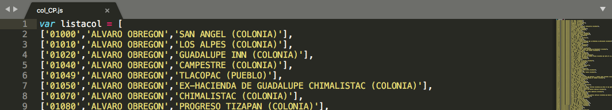

#  col_CP

Listado de colonias en la Ciudad de Mexico

## Procedimiento para crear el archivo CDMX.js


### Insumos

DataRetoH2Obis

Ejecucuión completa del proceso que genera el archivo [DataRetoH2Obis](/Docs/Gen_RH2O.md)

Detalle:

El proceso de datos demograficos y de información proporcionada por el Sistema de Aguas de la Ciudad de México a nivel de colonia queda totalmente integrado en un archivo: **DataRetoH2Obis**.

EL listado que aqui se refiere es un producto secundario de la generación del archivo geoespacial de colonias que se utiliza en un selector en la aplicación.

<hr>

### Detalle de procesamiento

Una vez que se ha completado el procesamiento de DataRetoH2Obis se genera un listado de colonias que se almacena en un archivo denominado **col_CP.js**

<hr>

#### Ajuste del archivo JS para su incorporacion en la página

En un editor de texto plano, *en nuestro caso usamos [**sublime text.app**](https://www.sublimetext.com/)*  se cambia el nombre de la variable en la primera linea  del archivo


*DICE*

**var col_CP = [**

*DEBE*

**var listacol = [**




<hr>


### Detalle del código R en CodigoDatos.R  


.... linea 624

```R
### listado desplegable

cp09_colcp<-shp09final@data%>%
  select(D_CP,MUN_NAME,D_ASENTA2)%>%filter(is.na(MUN_NAME) == F & is.na(D_ASENTA2)==F)%>%
  mutate(lista= paste0("['",D_CP,"','",MUN_NAME,"','",D_ASENTA2,"'],"))

## verificamos todo bien si repetidos 
cp09_colcp %>% group_by(D_ASENTA2,D_CP) %>% summarise(n=n()) %>% filter (n>1)

## deben eliminarse las comillas dobles
col_CP<-cp09_colcp[,c('D_CP','MUN_NAME','D_ASENTA2')]
creadatajs(col_CP,"DATOS2/",F)

## se edita y al inicio se cambia : col_CP por  listacol 


```


