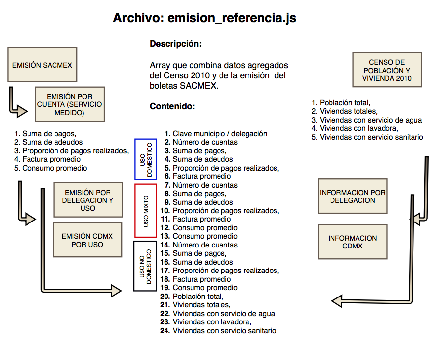

##  emision_referencia

Información geoespacial de las delegaciones de la Ciudad de Mexico que incluye variables demográficas del censo y datos del consumo de agua por tipo de uso: doméstico, mixto y NO doméstico.

### Procedimiento para crear el archivo emision_referencia.js




### Insumos


#### Datos agregados de la emsión de boletas de SACMEX (Sistema de Aguas de la Ciudad de México)

La Emisión SACMEX es un conjunto de archivos que corresponden a la información de las de agua en la CDMX durante los 6 bimestres de 2016. EL volumen de datos es relativamente bajo 12.6 millones de registros con 20 variables.

Esta información fue filtrada para considerar únicamente lo registros de Servicio Medido; posterioemente se agrupó por delegación y ciudad. Se obtuvieron 18 variales - 6 por cada uso **D**oméstico,  **M**ixto  y **NO D**oméstico  -

 +   Número de tomas

 +   Suma del importe pagado

 +   Suma del importe que se adeuda

 +   Proporción de boletas pagadas 

 +   Promedio de consumo bimestral

 +   Promedio del importe facturado 


#### Censo Población y Vivienda 2010 INEGI.

Censo de Población y Vivienda 2010. SNIEG. Información de Interés Nacional. [Censo2010](http://www.beta.inegi.org.mx/proyectos/ccpv/2010/default.html)
Conjunto de indicadores sobre la población y las viviendas de las AGEB y manzanas que integran las localidades urbanas del país, así como los totales por entidad, municipio y localidad urbana, provenientes del Censo de Población y Vivienda 2010.

Detalle:

El archivo se carga en un sistema de manejo de base de datos __ **CAD** utilizó Postgresql 9.6 __ siguiendo la estructura de datos que detalla el volumen correspondiente a la Ciudad de Mexico. 

En el código, la base de datos de referencia es *censo2010* y la *tabla* CDMX.

Por medio de consulta se generan datos demograficos agregados por delegación y ciudad:

+ Poblacion total 

+ Viviendas totales

+ Viviendas con servicio de agua

+ Viviendas con lavadora

+ Viviendas con servicio sanitario.


<hr>

#### Procesamiento

Una vez que se han generado los concentrados SACMEX y CENSO se unen los datos usando como llave la clave de delegación resultando un solo conjunto de datos que se formatea para construir un array JS.

### Detalle del código R en CodigoDatos.R  


.... linea 152

```R
### emisión por delegacion
EmisionXDEL<-EmisionXCuenta%>%
  group_by(USO,cve_mun)%>%
  summarise(DCTAS=n(),
            DPAGOS=sum(pagos),
            DDEUDA=sum(adeudos),
            DIDXCUM=mean(idxCumplimiento),
            DCONPRO= mean(consumoPromedio),
            DFACPRO= mean(facturaPromedio))%>%
  filter(USO=="DOMÉSTICO")%>%ungroup()%>%select(-USO)%>%
  full_join(
    (EmisionXCuenta%>%
       filter(USO=="MIXTO")%>%
       group_by(cve_mun)%>%
       summarise(MCTAS=n(),
                 MPAGOS=sum(pagos),
                 MDEUDA=sum(adeudos),
                 MIDXCUM=mean(idxCumplimiento),
                 MCONPRO= mean(consumoPromedio),
                 MFACPRO= mean(facturaPromedio))%>%
       ungroup()),
    by = c("cve_mun")
  )%>%
  full_join(
    (EmisionXCuenta%>%
       filter(USO=="NO DOMÉSTICO")%>%
       group_by(cve_mun)%>%
       summarise(NDCTAS=n(),
                 NDPAGOS=sum(pagos),
                 NDDEUDA=sum(adeudos),
                 NDIDXCUM=mean(idxCumplimiento),
                 NDCONPRO= mean(consumoPromedio),
                 NDFACPRO= mean(facturaPromedio))%>%
       ungroup()),
    by = c("cve_mun")
  )

saveRDS(EmisionXDEL , "DATOS2/EmisionXDEL.rds")

## integramos datos del Censo Nacional de poblacion y vivienda 2010
## se asume que ya esta cargado en postgresql 

## consultamos datos por delegacion: Poblacion total, Viviendas totales, viviendas con servicio de agua,
##  viviendas con lavadora, viviendas con servicio sanitario.


con <- dbConnect(PostgreSQL(), host="localhost", user= "postgres" , dbname="censo2010")
query= "select entidad as CVE_ENT, mun as CVE_MUN,  OCUPVIVPAR as pobtot, VIVPAR_HAB as vivtot, vph_aguadv,vph_lavad,vph_excsa from cpv2010 where entidad = '09' and mun != '000' and loc ='0000' and ageb= '0000' and mza ='000';"

data_del <- RPostgreSQL::dbGetQuery(con, query)%>%replace(is.na(.), 0)
colnames(data_del)<-toupper(colnames(data_del))

## integramos los datos DELEGACION de la emisión SACMEX con los del CENSO2010
deleg<-EmisionXDEL%>%left_join(data_del,by=c("cve_mun"="CVE_MUN"))
colnames(deleg)<-toupper(colnames(deleg))

saveRDS(deleg , "DATOS2/deleg.rds")

### datos del total del estado Ciudad de México
EmisionXCuenta$CVE_ENT='09'
EmisionXedo<-EmisionXCuenta%>%
  group_by(USO,CVE_ENT)%>%
  summarise(DCTAS=n(),
            DPAGOS=sum(pagos),
            DDEUDA=sum(adeudos),
            DIDXCUM=mean(idxCumplimiento),
            DCONPRO= mean(consumoPromedio),
            DFACPRO= mean(facturaPromedio))%>%
  filter(USO=="DOMÉSTICO")%>%ungroup()%>%select(-USO)%>%
  full_join(
    (EmisionXCuenta%>%
       filter(USO=="MIXTO")%>%
       group_by(CVE_ENT)%>%
       summarise(MCTAS=n(),
                 MPAGOS=sum(pagos),
                 MDEUDA=sum(adeudos),
                 MIDXCUM=mean(idxCumplimiento),
                 MCONPRO= mean(consumoPromedio),
                 MFACPRO= mean(facturaPromedio))%>%
       ungroup()),
    by = c("CVE_ENT")
  )%>%
  full_join(
    (EmisionXCuenta%>%
       filter(USO=="NO DOMÉSTICO")%>%
       group_by(CVE_ENT)%>%
       summarise(NDCTAS=n(),
                 NDPAGOS=sum(pagos),
                 NDDEUDA=sum(adeudos),
                 NDIDXCUM=mean(idxCumplimiento),
                 NDCONPRO= mean(consumoPromedio),
                 NDFACPRO= mean(facturaPromedio))%>%
       ungroup()),
    by = c("CVE_ENT")
  )

EmisionXedo$CVE_ENT='000'
colnames(EmisionXedo)[1]="cve_mun"

saveRDS(EmisionXedo , "DATOS2/EmisionXedo.rds")

con <- dbConnect(PostgreSQL(), host="localhost", user= "postgres" , dbname="censo2010")
query= "select entidad as CVE_ENT,'000' as CVE_MUN,  OCUPVIVPAR as pobtot, VIVPAR_HAB as vivtot, vph_aguadv,vph_lavad,vph_excsa from cpv2010 where entidad = '09' and mun = '000' and loc ='0000' and ageb= '0000' and mza ='000';"


data_ent <- RPostgreSQL::dbGetQuery(con, query)%>%replace(is.na(.), 0)
colnames(data_ent)<-toupper(colnames(data_ent))

enti<-EmisionXedo%>%left_join(data_ent,by=c("cve_mun"="CVE_MUN"))
colnames(enti)<-toupper(colnames(enti))

emision_referencia= rbind(deleg,enti)
saveRDS(emision_referencia , "DATOS2/emision_referencia.rds")

### genera archivo js de emision de referencia
creadatajs(emision_referencia,"DATOS2/",F)

```

