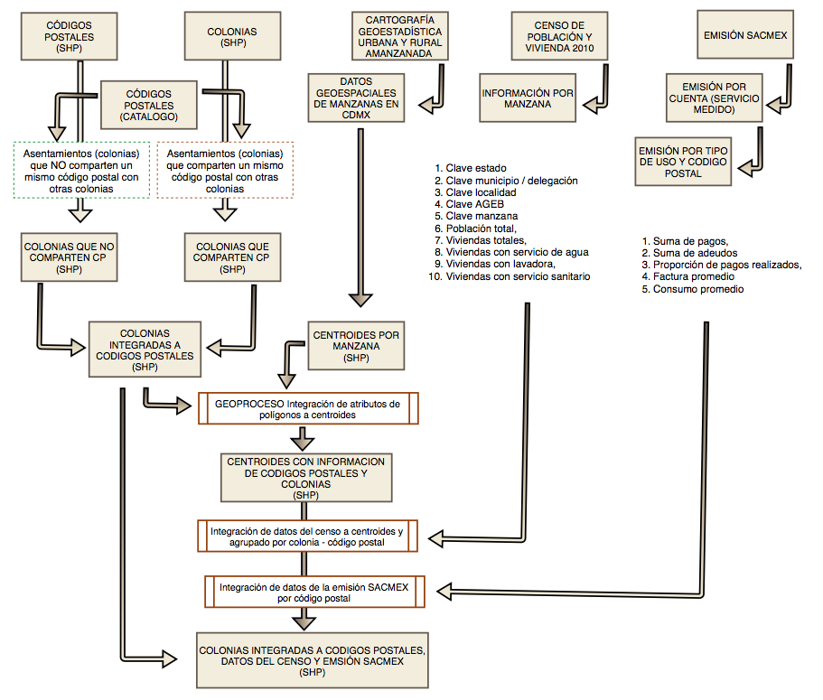
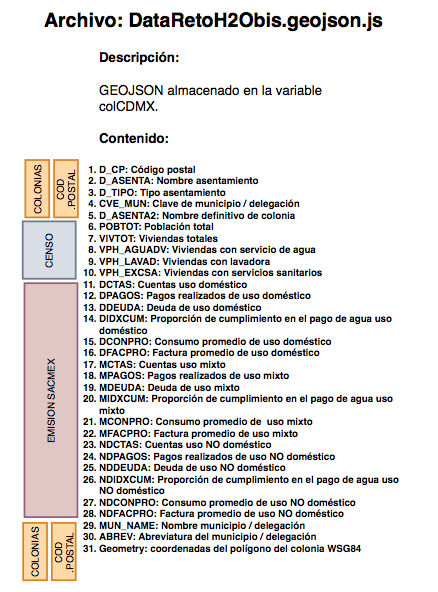
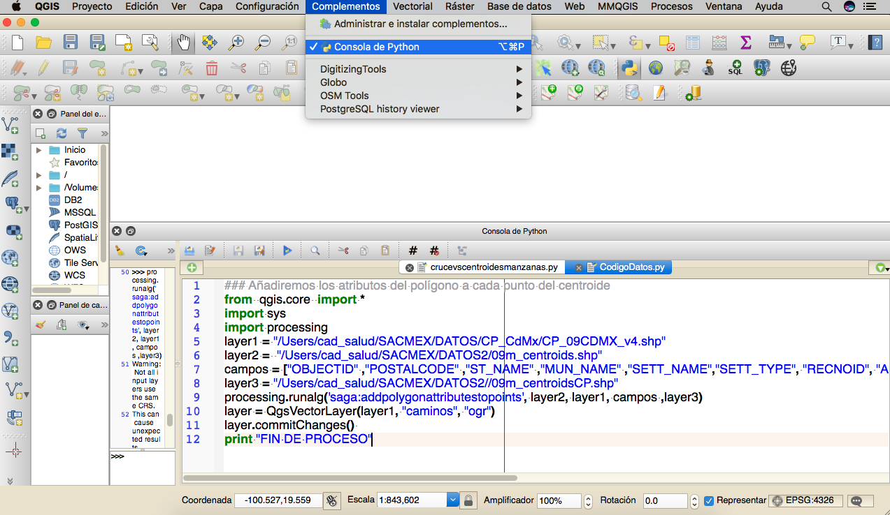
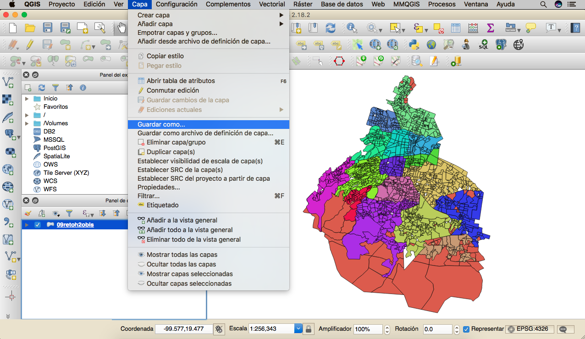
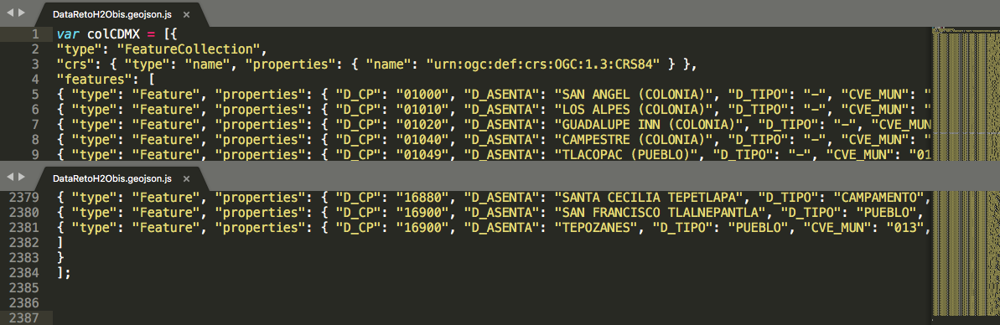

##  DataRetoH2Obis

Información geoespacial de las colonias de la Ciudad de Mexico que incluye variables demográficas del censo e información relativa al consumo de agua por tipo de uso: doméstico, mixto y NO doméstico.

### Procedimiento para crear el archivo munCDMX.js



#### Estructura de datos generada:




### Insumos


#### Datos agregados de la emsión de boletas de SACMEX (Sistema de Aguas de la Ciudad de México)

La Emisión SACMEX es un conjunto de archivos que corresponden a la información de las de agua en la CDMX durante los 6 bimestres de 2016. EL volumen de datos es relativamente bajo 12.6 millones de registros con 20 variables.

Esta información fue filtrada para considerar únicamente lo registros de Servicio Medido; posterioemente se agrupó por código postaly se obtuvieron 18 variales - 6 por cada uso **D**oméstico,  **M**ixto  y **NO D**oméstico  -

 +   Número de tomas

 +   Suma del importe pagado

 +   Suma del importe que se adeuda

 +   Proporción de boletas pagadas 

 +   Promedio de consumo bimestral

 +   Promedio del importe facturado 


#### Censo Población y Vivienda 2010 INEGI.

Censo de Población y Vivienda 2010. SNIEG. Información de Interés Nacional. [Censo2010](http://www.beta.inegi.org.mx/proyectos/ccpv/2010/default.html)
Conjunto de indicadores sobre la población y las viviendas de las AGEB y manzanas que integran las localidades urbanas del país, así como los totales por entidad, municipio y localidad urbana, provenientes del Censo de Población y Vivienda 2010.

Detalle:

El archivo se carga en un sistema de manejo de base de datos __ **CAD** utilizó Postgresql 9.6 __ siguiendo la estructura de datos que detalla el volumen correspondiente a la Ciudad de Mexico. 

En el código, la base de datos de referencia es *censo2010* y la *tabla* CDMX.

Por medio de consulta se generan datos demográficos agregados por **manzana** *(ver nota)*:

+ Poblacion total 

+ Viviendas totales

+ Viviendas con servicio de agua

+ Viviendas con lavadora

+ Viviendas con servicio sanitario.

*(nota)*  El censo no contiene información por colonia ni código postal, pero si por manzana. Para asociar los datos del censo a las colonias debemos asociar las manzanas a las colonias y posteriormente a los códigos postales. Esto es posible mediante un cruce geoespacial entre los datos geográficos de las manzanas con los datos geograficos de las colonias y  con los datos geograficos de los códigos postales.

#### Listado de Códigos Postales.

Listado de codigos postales de la Ciudad de México, indicando el asentamiento y tipo de asentamiento. [(desgarga)](http://www.sepomex.gob.mx/lservicios/servicios/CodigoPostal_Exportar.aspx)

Se busca dividir el listado en dos grupos:

+ Lista de asentamientos (colonias) que corresponden exclusivamente a un código postal

+ Lista de asentamientos (colonias) que comparten junto a otros asentamentos un mismo código postal

#### Información Geoespacial de Códigos Postales.

Corresponde a los polígonos geoespaciales de cada código postal en al Ciudad de México. Su descarga se realiza desde la [liga](https://datos.gob.mx/busca/dataset/codigos-postales-coordenadas-y-colonias) 

Se busca separar en dos grupos los poligonos cuyos códigos postales que corresponden exclusivamente a una colonia de aquellos que tienen una asignación múltiple.


#### Información Geoespacial de colonias.

Polígonos geoespaciales que corresponden a las colonias de México. La versión [disponible](http://datamx.io/dataset/colonias-mexico/resource/7b5a3b0a-4405-48d6-a4eb-d9f13bb50d3a)  no está actualizada por ello es necesario procesarla. 

Una vez que se han descargado se seleccionan las correspondientes a la Ciudad de México.

En virtud que uno de los atributos es el código postal es posible identificar las colonias que comparten código postal y separalas.

El proceso integrará esta información geoespacial con lo polígonos procesados de códigos postales para obtener una versión combinada de información geoespacial a nivel de colonia.

#### Marco Geoestadístico Nacional INEGI.

"El Marco Geoestadístico es un sistema único y de carácter nacional diseñado por el INEGI, el cual presenta la división del territorio nacional en diferentes niveles de desagregación para referir geográficamente la información estadística de los censos y encuestas institucionales y de las Unidades del Estado, que se integra al Sistema Nacional de Información Estadística y Geográfica (SNIEG)."


Detalle:

Archivo vectorial que integra un sistema único y de carácter nacional diseñado por el INEGI, el cual contiene las siguientes capas de información: 32 polígonos de las Áreas Geoestadísticas Estatales (AGEE), 2 463 polígonos de las Áreas Geoestadísticas Municipales (AGEM) en las que se incluyen las 16 Demarcaciones de la Ciudad de México, 17 469 polígonos de las Áreas Geoestadísticas Básicas Rurales (AGEB), 49 720 Polígonos de localidades urbanas y rurales, 351 polígonos del Territorio Insular (islas) y 254 789 Localidades rurales puntuales que no son amanzanadas y por lo tanto no cuentan con un plano. Cada Localidad urbana y rural cuenta con sus capas de amanzanamiento. Los elementos de estas capas cuenta con atributos de nombre y clave geoestadística

El Marco Geoestadístico Nacional es un producto de libre descarga proporcionado por INEGI mediante la [liga](http://www.beta.inegi.org.mx/app/biblioteca/ficha.html?upc=889463526636)  es importante realizar la descarga de la última versión disponible con desglose geogéfico a nivel de Ageb. 

Una vez descargado el archivo debe seleccionarse y descomprimirse el zip correspondiente al estado Ciudad de Mexico: **09_ciudaddemexico.zip**

De esta forma encontramos un arbol de carpetas

09_ciudaddemexico    
.    |____ catalogos      
.    |____ conjunto de datos     
.    |____ metadatos     


En la carpeta conjunto de datos tenemos información geoespacial de la Ciudad de México.

Los nombre comienzan con la clave INEGI de la entidad - en este caso 09-

Despues de la cclave "09" encontramos un sufijo que nos indica el contenido específico.  En el caso particular utilizamos el sufijo **m** que corresponde al shape **SHP** de manzanas en el estado

La información fuente esta formado por todos los archivos cuyos nombres comienzan con **09m.**

  + 09m.shp   (archivo principal)      

  + 09m.dbf

  + 09m.prj

  + 09m.sbn

  + 09m.sbx

  + 09m.shx

El SHP de manzanas resulta de utilidad porque buscamos asociar los datos del censo con las colonias. Para esto se toman los centroides de cada manzana y se determina por porcesamiento geoespacial la colonia a la cual pertenecen. 

### Geoproceso Asignación de atributos (información de colonias) a manzanas.

Los centroides de las manzanas constan de un par ordenado de valores que representan un punto geoespacial (coords(lat, lon)).

Para realizar el cruce geoespacial con la capa de polígonos de colonias se proyectan los puntos y los polígonos en un mismo objeto.

A partir de esto identifica cuales centroides -puntos coords(lat,lon)- caen dentro de cada polígonos y ello permite asociar los valores Código Postal y Colonia a cada centroide.

El geoproceso se realiza en la consola python de **Qgis 2.1**




### Integración de datos demográficos del censo.

Por medio de un query se seleccionan totales de 3 variables por delegación: Poblacion, Viviendas y Viviendas con servicio de agua y utilizando la instrucción left_join (biblioteca dplyr) se combinan los datos con el objeto geoespacial usaldo como llave la delecgación.

### Generación del archivo en geojson

Aunque R presenta la  función: ** geojson_write (biblioteca geojsonio) ** para transformar el objeto geoespacial en geojson resulta más sencillo realizar el ajuste utilizando **qgis 2.1**.

Se abre el archivo en **qgis 2.1** y se indica su su exportación vie menú:



***Es importante verificar que el tipo de archivo sea geojson y que el sistema de coordenadas sea WSG84 -por compatibilidad con leaflet-*** 

### Ajuste del archivo geojson para su incorporacion en la página

En un editor de texto plano, *en nuestro caso usamos [**sublime text.app**](https://www.sublimetext.com/)*  se añande al inicio del archivo la linea

**var colCDMX = [**

y al final del archivo se cierra agregando 

**]**



el archivo se guarda con la extensión **js**

<hr>

### Detalle del código R en CodigoDatos.R  


.... linea 282

```R
### emision por codigo postal
EmisionXCP<-EmisionXCuenta%>%
  group_by(USO,cve_mun,CP)%>%
  summarise(DCTAS=n(),
            DPAGOS=sum(pagos),
            DDEUDA=sum(adeudos),
            DIDXCUM=mean(idxCumplimiento),
            DCONPRO= mean(consumoPromedio),
            DFACPRO= mean(facturaPromedio))%>%
  filter(USO=="DOMÉSTICO")%>%ungroup()%>%select(-USO)%>%
  full_join(
    (EmisionXCuenta%>%
       filter(USO=="MIXTO")%>%
       group_by(cve_mun,CP)%>%
       summarise(MCTAS=n(),
                 MPAGOS=sum(pagos),
                 MDEUDA=sum(adeudos),
                 MIDXCUM=mean(idxCumplimiento),
                 MCONPRO= mean(consumoPromedio),
                 MFACPRO= mean(facturaPromedio))%>%
       ungroup()),
    by = c("cve_mun","CP")
  )%>%
  full_join(
    (EmisionXCuenta%>%
       filter(USO=="NO DOMÉSTICO")%>%
       group_by(cve_mun,CP)%>%
       summarise(NDCTAS=n(),
                 NDPAGOS=sum(pagos),
                 NDDEUDA=sum(adeudos),
                 NDIDXCUM=mean(idxCumplimiento),
                 NDCONPRO= mean(consumoPromedio),
                 NDFACPRO= mean(facturaPromedio))%>%
       ungroup()),
    by = c("cve_mun","CP")
  )

saveRDS(EmisionXCP , "DATOS2/EmisionXCP.rds")

### la EmisionXCP tiene 1144 codigos postales distintos
length(unique(EmisionXCP$CP))


## leemos el geoObjeto  de codigos postales de la ciudad de mexico
shp09cp <- readOGR("/Users/cad_salud/SACMEX/DATOS/CP_CdMx/", 'CP_09CDMX_v4')
## tenemos 1225 poligonos de codigos postales
listaCP2c<-as.character(shp09cp@data$d_cp)
sum(EmisionXCP$CP%in%listaCP2c) ### 1067 localidados

## leemos el geoObjeto  de colonias general
shp09C <- readOGR("/Users/cad_salud/SACMEX/DATOS/Colonias/", 'Colonias')
### filtramos para obtener unicamente cdmx
shp09C <- shp09C[shp09C$ST_NAME =='DISTRITO FEDERAL',]
### 2097 poligonos de colonias en CDMX

listaCP2a<-shp09C@data$POSTALCODE
sum(EmisionXCP$CP%in%listaCP2a)  ### 1013 localidados
cpsfaltantes <-EmisionXCP[!(EmisionXCP$CP%in%listaCP2a),]$CP

sum(cpsfaltantes%in%listaCP2c) ### 82 localidados de los faltantes
length(unique(listaCP2a)) ### 1142

## aseguramos que la proyeccion de las colonias sea wgs84
shp09 <- spTransform(shp09C, CRS("+proj=longlat +datum=WGS84"))
## agregamos un identificador de renglon consecutivo
shp09@data$RECNOID= c(1:nrow(shp09@data))
### quitamos acentos
shp09@data$MUN_NAME=sinAccento(shp09@data$MUN_NAME)
shp09@data$SETT_NAME=sinAccento(shp09@data$SETT_NAME)
shp09@data$SETT_TYPE=sinAccento(shp09@data$SETT_TYPE)
#eliminamos campos que no usaremos 
shp09@data$AREA=NULL
shp09@data$Shape_Leng=NULL
shp09@data$Shape_Area=NULL
## ajsutamos el nombre del estado a CIUDAD DE MEXICO
shp09@data$ST_NAME = 'CIUDAD DE MEXICO'
## asignamos campos de claves y abreviatura de la delegacion
MUN_NAME =c("ALVARO OBREGON","AZCAPOTZALCO","BENITO JUAREZ","COYOACAN","CUAJIMALPA DE MORELOS","CUAUHTEMOC","GUSTAVO A MADERO","IZTACALCO","IZTAPALAPA","LA MAGDALENA CONTRERAS","MIGUEL HIDALGO","MILPA ALTA","TLAHUAC","TLALPAN","VENUSTIANO CARRANZA","XOCHIMILCO" )           
ABREV =c("A.OBREGON","AZCAPOTZALCO","B.JUAREZ","COYOACAN","CUAJIMALPA","CUAUHTEMOC","G.A.MADERO","IZTACALCO","IZTAPALAPA","M.CONTRERAS","M.HIDALGO","M.ALTA","TLAHUAC","TLALPAN","V.CARRANZA","XOCHIMILCO")
CVE_MUN=c("010","002","014","003","004","015","005","006","007","008","016","009","011","012","017","013");
tblextra<-data.frame(cbind(MUN_NAME,ABREV,CVE_MUN),stringsAsFactors = F)
shp09@data=shp09@data%>%left_join(tblextra)
## todo a utf8
shp09@data$POSTALCODE=iconv(shp09@data$POSTALCODE,from = 'latin1', to = "UTF-8")
shp09@data$ST_NAME=iconv(shp09@data$ST_NAME,from = 'latin1', to = "UTF-8")
shp09@data$MUN_NAME=iconv(shp09@data$MUN_NAME,from = 'latin1', to = "UTF-8")
shp09@data$SETT_NAME=iconv(shp09@data$SETT_NAME,from = 'latin1', to = "UTF-8")
shp09@data$SETT_TYPE=iconv(shp09@data$SETT_TYPE,from = 'latin1', to = "UTF-8")
shp09@data$ABREV=iconv(shp09@data$ABREV,from = 'latin1', to = "UTF-8")
shp09@data$CVE_MUN=iconv(shp09@data$CVE_MUN,from = 'latin1', to = "UTF-8")
## guardamos shp de colonias porque vamos a cruzarlo con el de manzanas para obtener información agrupada por colonia
writeOGR(shp09, "DATOS2/", "ColoniasCDMX", driver="ESRI Shapefile",overwrite_layer = TRUE)

#####################
##leemos las colonias recien ajustadas
shp09_COL09 <- readOGR("DATOS2/", 'ColoniasCDMX')

lstcp<-shp09_COL09@data%>%group_by(POSTALCODE)%>%summarise(n=n())%>%ungroup()%>%filter(n>1)

##leemos el catalogo de códigos postales
cp09<-read.csv2('DATOS/CP_CdMx/CPdescarga20180220.txt',skip = 1,sep = '|',header = T,stringsAsFactors=FALSE, fileEncoding="latin1", colClasses = rep("character",15)) %>%
  filter(c_estado=='09')
##listado de CP multiples 
multiCP<-cp09%>%group_by(d_codigo)%>%summarise(n=n())%>%ungroup()%>%filter(n>1)
### verificamos cuantos poligomos de colonias tenemos identificados en multiCP
sum(lstcp$POSTALCODE %in% unique(multiCP$d_codigo))  ## 217 CP's de colonias multiples se ubican de los 272 actuales casos
sum(lstcp$n) ## 1365 casos en multiplicidad en colonias
###reducimos la multiplicidad a los casos que tenemos con SHP 
multiCP=multiCP[multiCP$d_codigo %in% lstcp$POSTALCODE,]  ## 217 casos con 638 asentamientos

## separamos el layer en un shp especial que mas adelante se añadirá al shape de CP's que corresponden a una colonia
shp09_COL09_multi<-shp09_COL09[shp09_COL09$POSTALCODE %in% lstcp$POSTALCODE, ]
shp09_COL09_multi@data=shp09_COL09_multi@data%>%rename( D_CP = POSTALCODE,D_ASENTA=SETT_NAME ,D_TIPO=SETT_TYPE)
#integramos campo llave de busqueda
shp09_COL09_multi@data$D_ASENTA2 =  paste0(shp09_COL09_multi@data$D_ASENTA , " (-" ,shp09_COL09_multi@data$D_TIPO, "-) ")

##quitamos columnas 
shp09_COL09_multi@data$ST_NAME=NULL
shp09_COL09_multi@data$MUN_NAME=NULL
shp09_COL09_multi@data$RECNOID=NULL
shp09_COL09_multi@data$ABREV=NULL
shp09_COL09_multi@data$OBJECTID=NULL

writeOGR(shp09_COL09_multi, "DATOS2/", "ColoniasCDMXmulti", driver="ESRI Shapefile",overwrite_layer = TRUE)

###leemos el shp de codigos postales más reciente
shp09_cp <- readOGR("/Users/cad_salud/SACMEX/DATOS/CP_CdMx/", 'CP_09CDMX_v4')
## aseguramos que la proyeccion sea wgs84
shp09cp <- spTransform(shp09_cp, CRS("+proj=longlat +datum=WGS84 +no_defs +ellps=WGS84 +towgs84=0,0,0"))
writeOGR(shp09cp, "DATOS2/", "CP_09wgs84", driver="ESRI Shapefile",overwrite_layer = TRUE)

### verificamos cuantos poligomos de colonias tenemos identificados en multiCP
sum(shp09cp@data$d_cp %in%multiCP$d_codigo)  ## 213 casos
sum(multiCP$n) ## 638 casos en multiplicidad
#### contabilizamos en terminos de CP's distintos
sum(unique(shp09cp@data$d_cp) %in%multiCP$d_codigo) ## 213 de 272 originales
## (4 CP's no esta localizados pero si se mostraran poruqe ya existen en colonias)

## separamos el layer en un shp especial que mas adelante se añadirá al shape de CP's que corresponden a una colonia
shp09cp_simple<-shp09cp[!(shp09cp$d_cp %in% multiCP$d_codigo), ]

##Preparamos  información este layer simple no tiene datos

### DATOS DE CP's que NO comparten código postal 
cp09_b<-cp09[!(cp09$d_codigo %in% multiCP$d_codigo),]%>%
  select(d_codigo,d_asenta,d_tipo_asenta,c_mnpio)%>%arrange(d_codigo)%>%
  right_join(cp09%>%group_by(d_codigo)%>%summarise(n=n())%>%ungroup())%>%
  mutate(D_ASENTA=toupper(sinAccento(d_asenta)),D_TIPO= toupper(sinAccento(d_tipo_asenta)),D_CP=d_codigo, CVE_MUN=c_mnpio)%>%
  mutate(D_ASENTA2 = paste0(D_ASENTA , " (" ,D_TIPO, ") "))%>%filter(!is.na(D_ASENTA))
## vectorizamos el nombre del asentamiento para que se reduzca a un solo renglon
## para estos casos no existen shapes separados pero el poligono apuntará al una 
## posicion aproximada

cp09_b2<-unique(cp09_b[,c('D_CP','CVE_MUN')])

### funcion que integra multi asentamientos 
geMultiAsentamientos=function(cpost){
  selected=cp09_b%>%filter(D_CP==cpost)%>%select(D_CP, D_ASENTA2)%>%spread(key = D_ASENTA2,value = D_ASENTA2)
  columnas<-names(selected%>%select(-D_CP))
  salida=selected%>%unite(col='D_ASENTA2',columnas,sep= "|| ")
  return(salida) ### la salida es un df de 1 renglón
}

library(purrr)  ### para poder usar funciones map
cp09_c<-unique(cp09_b$d_codigo)%>% 
  map_dfr(.,geMultiAsentamientos) %>% ### integra las salidas por rbind
  left_join(cp09_b2)

cp09_c$D_ASENTA =cp09_c$D_ASENTA2 
cp09_c$D_TIPO ="-"

shp09cp_simple@data=shp09cp_simple@data%>%
  left_join(cp09_c%>%
              select(D_CP,D_ASENTA,D_TIPO,CVE_MUN ,D_ASENTA2),by = c("d_cp"="D_CP"))
## ajustamos el nombre del campo CP
shp09cp_simple@data=shp09cp_simple@data%>%rename(D_CP=d_cp)
writeOGR(shp09cp_simple, "DATOS2/", "ColoniasCDMXsimple", driver="ESRI Shapefile",overwrite_layer = TRUE)

##Veamos la union del multi y el simple aunque se traslapen en algunos casos

shp09cp_unido = rbind.SpatialPolygonsDataFrame(shp09cp_simple,shp09_COL09_multi,makeUniqueIDs = T)
shp09cp_simple@proj4string
shp09_COL09_multi@proj4string

writeOGR(shp09cp_unido, "DATOS2/", "ColoniasCDMXunido", driver="ESRI Shapefile",overwrite_layer = TRUE)

#### leemos el archivo recien construido que ya contiene 2377 policgonos
shp09cp_unido <- readOGR("DATOS2/", 'ColoniasCDMXunido')

##############


### asignacion de codigos postales a los datos del censo de poblacion
### se toman el shp de manzanas y se calculan los centriodes mismos que se cruzan con los poligonos de codigos postales
### decimos que una manzana corresponde a un codigo postal si su centroide se localiza dentro del área que forma el codigo postal
### con ello podemos saber cual es la población, viviendas, viviendas con regadera, wc, servicio de agua por CP
### y aplicar proporciones mas adecuadas a la experiencia de usuario en la calculadora de consumo responsable de agua

### abrimos el shp de manzanas en cdmx
shp09_m <- readOGR("/Users/cad_salud/SACMEX/DATOS/AGEBS_CDMX/conjunto de datos/", '09m')
### aseguramos que la proyeccion sea wgs84
shp09_mza <- spTransform(shp09_m, CRS("+proj=longlat +datum=WGS84"))
## eliminamos el campo que no usamos
shp09_mza@data$TIPOMZA<- NULL
### almacenamos la variable de proyeccion que mas adelante asignaremos al layer de centroides
proj4strmzaBASE<-shp09_mza@proj4string
### calculamos los centroides de los poligonos de las manzanas
centroids <- getSpPPolygonsLabptSlots(shp09_mza)
centroids2<-as.data.frame(centroids)
colnames(centroids2)<- c("x","y")
##añadimos los centroides al data del shape de manzanas
pointsMZA<-cbind(centroids2,shp09_mza@data)
### asignamos la proyeccion a los centroides 
puntos<-SpatialPoints(centroids2, proj4string=proj4strmzaBASE)
### construimos el layer de puntos
centroidMZAlayer<-SpatialPointsDataFrame(coords = puntos,data = pointsMZA,proj4string = proj4strmzaBASE)
## guardamos para realizar el cruce en QGIS vs Codigos postales
writeOGR(obj = centroidMZAlayer, dsn = 'DATOS2/', layer = '09m_centroids', driver="ESRI Shapefile",overwrite_layer = TRUE)


####

####codigo python 
### Añadiremos los atributos del polígono a cada punto del centroide
# import processing
# ## PROCESO INTERSECCION SEGUNDA PARTE
# layer1 = "/Users/cad_salud/SACMEX/DATOS/CP_CdMx/CP_09CDMX_v4.shp"
# layer2 =  "/Users/cad_salud/SACMEX/DATOS/AGEBS_CDMX/conjunto de datos/09m_centroids.shp"
# campos = ["OBJECTID" ,"POSTALCODE" ,"ST_NAME" ,"MUN_NAME" ,"SETT_NAME","SETT_TYPE", "RECNOID", "ABREV","CVE_MUN"]
# layer3 = "/Users/cad_salud/SACMEX/DATOS2//09m_centroidsCP.shp"
# processing.runalg('saga:addpolygonattributestopoints', layer2, layer1, campos ,layer3)
# layer = QgsVectorLayer(layer1, "caminos", "ogr")
# layer.commitChanges() 
# # 
# print "FIN DE PROCESO"####
# 
# 

### leemos el shp generado  

shp09_mc <- readOGR("/Users/cad_salud/SACMEX/DATOS/AGEBS_CDMX/conjunto de datos/", '09m_centroidsCP')
## eliminamos los registros incompletos (31 casos)
shp09_mc@data<-shp09_mc@data[!is.na(shp09_mc@data$d_cp),]
### añadimos la información del censo a nivel de manzana
### leemos datos del censo 2010
con <- dbConnect(PostgreSQL(), host="localhost", user= "postgres" , dbname="censo2010")
query= "select entidad as CVE_ENT, mun as CVE_MUN, loc as cve_loc, ageb as cve_ageb, mza as cve_mza, pobtot, vivtot, vph_aguadv,vph_lavad,vph_excsa from cpv2010 where entidad = '09' and mun != '000' and loc !='0000' and ageb!= '0000' and mza !='000';"

query= "select entidad as CVE_ENT, mun as CVE_MUN, loc as cve_loc, ageb as cve_ageb, mza as cve_mza, OCUPVIVPAR as pobtot, VIVPAR_HAB as vivtot, vph_aguadv,vph_lavad,vph_excsa from cpv2010 where entidad = '09' and mun != '000' and loc !='0000' and ageb!= '0000' and mza ='000';"

data_mza <- RPostgreSQL::dbGetQuery(con, query)%>%replace(is.na(.), 0)
colnames(data_mza)<-toupper(colnames(data_mza))
saveRDS(data_mza,"DATOS2/data_mza.rds")

###integramos los datos en el shp  de manzana
shp09_mc@data=shp09_mc@data%>%inner_join(data_mza%>%select(-CVE_MZA))
### agrupamos los datos por CP
data_mc=shp09_mc@data%>%
  group_by(d_cp,CVE_MUN)%>%
  summarise(POBTOT=mean(POBTOT) ,
            VIVTOT=mean(VIVTOT),
            VPH_AGUADV=mean(VPH_AGUADV),
            VPH_LAVAD=mean(VPH_LAVAD),
            VPH_EXCSA=mean(VPH_EXCSA))%>%
  ungroup()%>%
  left_join(EmisionXCP,
            by = c("d_cp"="CP")
  )%>%
  filter(is.na(POBTOT)==F | POBTOT<1 |  VIVTOT<1)
summary(data_mc)

## todos los CP en este dataframe estan en el SHP unido 
## 0 = nada falta
sum(!(data_mc$d_cp %in% shp09cp_unido@data$D_CP))

## generamos el SHP ampliado que se usa en la aplicacion
data_mc2<-data.frame(data_mc)
shp09final <- readOGR("DATOS2/", "ColoniasCDMXunido")
shp09final@data= shp09final@data%>%left_join(data_mc2, by = c("D_CP"= "d_cp","CVE_MUN","CVE_MUN") )
##quitamos campos
shp09final@data$cve_mun=NULL
## añadimos descriptores de delegaciones
MUN_NAME =c("ALVARO OBREGON","AZCAPOTZALCO","BENITO JUAREZ","COYOACAN","CUAJIMALPA DE MORELOS","CUAUHTEMOC","GUSTAVO A MADERO","IZTACALCO","IZTAPALAPA","LA MAGDALENA CONTRERAS","MIGUEL HIDALGO","MILPA ALTA","TLAHUAC","TLALPAN","VENUSTIANO CARRANZA","XOCHIMILCO" )           
ABREV =c("A.OBREGON","AZCAPOTZALCO","B.JUAREZ","COYOACAN","CUAJIMALPA","CUAUHTEMOC","G.A.MADERO","IZTACALCO","IZTAPALAPA","M.CONTRERAS","M.HIDALGO","M.ALTA","TLAHUAC","TLALPAN","V.CARRANZA","XOCHIMILCO")
CVE_MUN=c("010","002","014","003","004","015","005","006","007","008","016","009","011","012","017","013");
tblextra<-data.frame(cbind(MUN_NAME,ABREV,CVE_MUN),stringsAsFactors = F)
shp09final@data= shp09final@data%>%left_join(tblextra, by = c("CVE_MUN","CVE_MUN") )

writeOGR(obj = shp09final, dsn = 'DATOS2/', layer = '09retoh2obis', driver="ESRI Shapefile",overwrite_layer = TRUE)
shp09final


```

