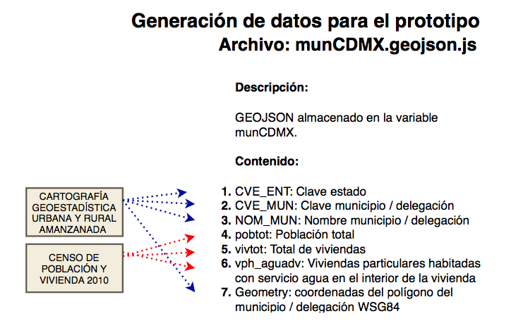
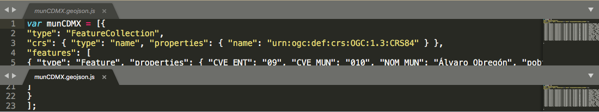

##  munCDMX

Información geoespacial de las delegaciones de la Ciudad de Mexico que incluye variables demográficas del censo

### Procedimiento para crear el archivo munCDMX.js




### Insumos

Censo Población y Vivienda 2010 INEGI.

Censo de Población y Vivienda 2010. SNIEG. Información de Interés Nacional.
Conjunto de indicadores sobre la población y las viviendas de las AGEB y manzanas que integran las localidades urbanas del país, así como los totales por entidad, municipio y localidad urbana, provenientes del Censo de Población y Vivienda 2010.

Detalle:

El archivo se carga en un sistema de manejo de base de datos, en este caso Postgresql de acuerdo la la estructura de datos que detalla el volumen correspondiente a la Ciudad de Mexico. 

La base de datos de referencia en el código es censo2010 y la tabla CDMX.


Marco Geoestadístico Nacional INEGI.

"El Marco Geoestadístico es un sistema único y de carácter nacional diseñado por el INEGI, el cual presenta la división del territorio nacional en diferentes niveles de desagregación para referir geográficamente la información estadística de los censos y encuestas institucionales y de las Unidades del Estado, que se integra al Sistema Nacional de Información Estadística y Geográfica (SNIEG)."


Detalle:

Archivo vectorial que integra un sistema único y de carácter nacional diseñado por el INEGI, el cual contiene las siguientes capas de información: 32 polígonos de las Áreas Geoestadísticas Estatales (AGEE), 2 463 polígonos de las Áreas Geoestadísticas Municipales (AGEM) en las que se incluyen las 16 Demarcaciones de la Ciudad de México, 17 469 polígonos de las Áreas Geoestadísticas Básicas Rurales (AGEB), 49 720 Polígonos de localidades urbanas y rurales, 351 polígonos del Territorio Insular (islas) y 254 789 Localidades rurales puntuales que no son amanzanadas y por lo tanto no cuentan con un plano. Cada Localidad urbana y rural cuenta con sus capas de amanzanamiento. Los elementos de estas capas cuenta con atributos de nombre y clave geoestadística


El Marco Geoestadístico Nacional es un producto de libre descarga proporcionado por INEGI mediante la [liga](http://www.beta.inegi.org.mx/temas/mapas/mg/)  es importante realizar la descarga de la última versión disponible con desglose geogéfico a nivel de Ageb. 


Una vez descargado el archivo debe seleccionarse y descomprimirse el zip correspondiente al estado Ciudad de Mexico: **09_ciudaddemexico.zip**

De esta forma encontramos un arbol de carpetas

09_ciudaddemexico    
.    |____ catalogos      
.    |____ conjunto de datos     
.    |____ metadatos     


En la carpeta conjunto de datos tenemos información geoespacial de la Ciudad de México.

Los nombre comienzan con la clave INEGI de la entidad - en este caso 09-

Despues de la cclave "09" encontramos un sufijo que nos indica el contenido específico.  En el caso particular utilizamos el sufijo **ent** que corresponde al shape **SHP** de todos el estado

La información fuente esta formado por todos los archivos cuyos nombres comienzan con **09mun.**

  + 09mun.shp   (archivo principal)      

  + 09mun.dbf

  + 09mun.prj

  + 09mun.sbn

  + 09mun.sbx

  + 09mun.shx


### Apertura de información en Qgis   

**Requisito:**   En el equipo donde procesará la información debe contar con los programas [**R**](https://www.r-project.org/) R Project, [**RSstudio**](https://www.rstudio.com/)  y  [**Qgis**](https://qgis.org/en/site/) A Free and Open Source Geographic Information System.   


### Integración de datos demográficos del censo.

Por medio de un query se seleccionan totales de 3 variables por delegación: Poblacion, Viviendas y Viviendas con servicio de agua y utilizando la instrucción left_join (biblioteca dplyr) se combinan los datos con el objeto geoespacial usando como llave la delecgación.

#### Generación del archivo en geojson

El código en R presenta la  función: ** geojson_write (biblioteca geojsonio) **


### Ajuste del archivo geojson para su incorporacion en la página

En un editor de texto plano, *en nuestro caso usamos [**sublime text.app**](https://www.sublimetext.com/)*  se añande al inicio del archivo la linea

**var munCDMX = [**

y al final del archivo se cierra 

**]**





el archivo se guarda con la extensión **js**

<hr>

### Detalle del código R en CodigoDatos.R  


.... linea 654

```R
#### generacion del shape mpoCDMX en geojson
con <- dbConnect(PostgreSQL(), host="localhost", user= "postgres" , dbname="censo2010")
query= "select entidad as cve_ent, mun as cve_mun, sum(pobtot) as pobtot, sum(vivtot) as vivtot, sum(vph_aguadv ) as vph_aguadv from CDMX group by entidad, mun;"
resumenMunicipal <- RPostgreSQL::dbGetQuery(con, query)
ogrfileMPOS = "E09areas_geoestadisticas_municipales"
shapempoCDMX <- readOGR(ruta, ogrfileMPOS)
map_wgs84mpoCDMX <- spTransform(shapempoCDMX, CRS("+proj=longlat +datum=WGS84"))
map_wgs84mpoCDMX@data$AREA<-NULL
map_wgs84mpoCDMX@data<-map_wgs84mpoCDMX@data%>%left_join(resumenMunicipal,by=c("CVE_ENT"="cve_ent","CVE_MUN"="cve_mun"))
writeOGR(obj = map_wgs84mpoCDMX, dsn = 'DATOS2/', layer = '09MPOampl', driver="ESRI Shapefile",overwrite_layer = TRUE)
json_ent<-geojson_json(map_wgs84mpoCDMX)
geojson_write(json_ent, file = "DATOS2/munCDMX.geojson")


```


