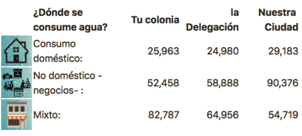
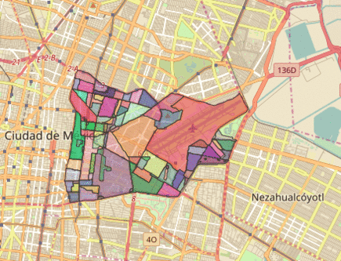

<table >
<tr >
 <td></td>
<td>&nbsp&nbsp&nbsp&nbsp&nbsp&nbsp&nbsp&nbsp&nbsp&nbsp&nbsp&nbsp&nbsp&nbsp&nbsp&nbsp&nbsp&nbsp&nbsp&nbsp&nbsp&nbsp&nbsp&nbsp&nbsp&nbsp&nbsp&nbsp&nbsp&nbsp&nbsp&nbsp&nbsp&nbsp&nbsp</td>
<td>
 
Centro de Análisis de Datos
</td>
<td>&nbsp&nbsp&nbsp&nbsp&nbsp&nbsp&nbsp&nbsp&nbsp&nbsp&nbsp&nbsp&nbsp&nbsp&nbsp&nbsp&nbsp&nbsp&nbsp&nbsp&nbsp&nbsp&nbsp&nbsp&nbsp&nbsp&nbsp&nbsp&nbsp&nbsp&nbsp&nbsp&nbsp&nbsp&nbsp&nbsp&nbsp&nbsp&nbsp</td>
 <td></td>
</tr>
</table>

## Reto agua

**nl.mr:** El agua potable es un recurso escaso en las grandes ciudades las acciones de la autoridad y los usuarios de agua son importantes. 

Enfrentamos un problema multifactorial:

+ Oferta del servicio limitada. El Sistema de Aguas de la Ciudad de México (SACMEX) enfrenta retos para el mantenimiento y ampliacíon de la red de abasto; 

+ Valor no reconocido. Los usuarios del servicio presentan un atraso significativo en el pago de boletas de agua.

+ Desconocimiento de mejores pautas de consumo. En general persisten patrones consumo deben ser ajustados y poca difusión de las acciones que deben tomarse para mitigar del problema.

El Laboratorio  para la ciudad, convocó a organizaciones para proponer soluciones tecnológicas para la tención de de retos diversos que enfrenta la ciudad siendo AGUA uno de ellos. 
 
En este espacio se presenta en forma abierta la herramienta-prototipo elaborada por CAD para el reto AGUA. Todos podemos evaluar nuestras pautas de consumo de agua en el hogar, compararlas con muestros vecinos y fortalecer acciones hídricas informadas.

## Descripción.

La herramienta sigue la secuencia lógica de toda evaluación:  

####  1-Obtener información ->  2-Evaluar ->  3-Informar y generar propuestas

### :one:  a partir de algunas preguntas simples... 

### :two:  Evaluamos el nivel de responsabilidad en el uso doméstico de agua... 

### :three: Proponemos acciones para mitigar el desperdicio  ...

### :heavy_plus_sign: Informamos, cuales son los niveles de consumo de agua de los vecinos ... en la colonia, delegación y ciudad 

<table>
<tr>
<td> 
 
 </td>
<td>

</td>
</tr>
</table>

*Todos los datos proporcionados en las vistas de la herramienta son reales - se elaboraron con base al censo de población y vivienda, recomendaciones de diversos colaboradores y datos de facturación del Sistema de Aguas de la Ciudad de México-.*

## Explóralo ¡revisa el código! 

La pagina web con la herramienta de evaluación de consumo de agua fue escrita directamente en texto llano sin utilizar interfaces de desarrollo siguiendo las líneas generales de **HTML5-CSS3-JS.** 

Es muy probable que el DOM (Document Object Model) de la herramienta no resulte ortodoxo para los más versados en el tema. La idea fundamental es generar un **prototipo** que posea **funcionalidad** y deje libre aspectos de diseño en la adopción / inclusión del mismo.

Quien quiera puede descubrir fácilmente cómo se logró la integración funcional de algún objeto en el código. Seguramente verá reflejadas las recomendaciones comunes que se comparten libremente en sitios colaborativos como [stack overflow](https://stackoverflow.com/) y en la documentación abierta de los componentes *JS*: [Leaflet](https://leafletjs.com/) o  [Plotlyjs](https://plot.ly/javascript/)

### Descarga 

Para descargar la herramienta basta con tomar el archivo [ZIP](download/RH20page.zip) 

### Instalación 

Copia el árbol de carpetas que se obtienen al descomrpimir el zip  (incluido el archivo Index.html)  dentro de la ubicación que le desee asignar funcionalmente en su repositorio web o computadora.

### Ejecución

Basta con abrir el archivo Index.html (o llamar url) en el explorador favorito

*se ha verificado funcionamento correcto en Chrome 63+, Safari 11+ y Firefox 57+.*

**!Importante:** Se requiere acceso a internet para su correcto funcionamiento ya que la herramienta dibuja poligonos geoespaciales sobre mapas leaflet.

### Construcción de información 

La herramienta utiliza un set de datos preprocesado. **CAD** enriqueció los poligonos geoespaciales de la ciudad de méxico con los shapes de códigos postales y colonias. Posteriormente le adjuntó datos del censo y cifras reales del consumo agua ( SACMEX:  volumen, facturación, pagos, tipo de usuario).

Los detalles técnicos relativos la generación de información que soporta la evaluación del consumo de agua se encuentran [aquí](/Docs/Estructura_Datos.md)

### Deseas contribuir

Cualquier idea, comentario, rectificación, es bienvenido....

No dudes en comunicarte con nosotros y con gusto revisaremos los puntos que resulten necesarios.

Usa las facilidaes colaborativas en github **¡contáctanos!**

### Créditos

#### Participantes en el proyecto

+ Centro de Análisis de Datos

+ Laboratorio para la Ciudad

+ Sistema de Aguas de la Ciudad de México

#### Herramientas Utilizadas

<table>
  <tr>
    <td><a href="https://code.jquery.com/">Jquery</a></td>
    <td><a href="https://tether.io/">Tether</a></td>
    <td><a href="https://getbootstrap.com/">Bootstrap</a></td>
    <td><a href="https://mathjs.org/">Mathjs</a></td>
    <td><a href="https://datatables.net/">Datatables</a></td>
  </tr>
  <tr>
    <td><a href="https://plot.ly/javascript/">Plotly.js</a></td>
    <td><a href="https://leaverou.github.io/awesomplete/">Awesomplete</a></td>
    <td><a href="https://leafletjs.com/">Leafletjs</a></td>
    <td><a href="https://qgis.org/en/site/">Qgis</a></td>
    <td><a href="https://www.rstudio.com/">R-Studio</a></td>
  </tr>
  
</table>

### Open Data Sets

*La información que se presenta es de libre reproduccion bajo responsabilidad del usuario.*

[Consulta ... Descarga ... Revisa ..,Transforma ... Comparte ](/Docs/OpenData)

## Tipo de licencia

[MIT](/Docs/LicenciaMIT.md)
